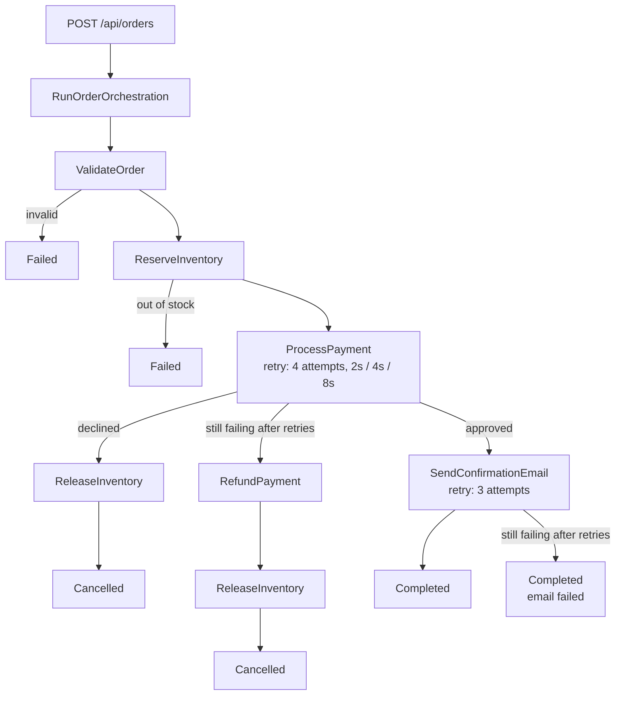

# Azure Durable Functions

[](https://github.com/paulap887/DurableFunction/actions/workflows/ci.yml)


[](https://medium.com/gitconnected/stop-managing-state-let-azure-durable-functions-do-it-for-you-ed163c6f4d2c)

Companion code for the article **[Stop Managing State: Let Azure Durable Functions Do It for You](https://medium.com/gitconnected/stop-managing-state-let-azure-durable-functions-do-it-for-you-ed163c6f4d2c)**.

A working example of an Azure Durable Functions order processing workflow built with .NET 9 and the isolated worker model. Covers the full orchestration pattern (HTTP trigger → orchestrator → activity functions → status polling) and the parts that make it production-shaped: **retries with exponential backoff, the Saga pattern with compensation, idempotent activities and progress reporting**, all covered by unit tests.

## Workflow



Each step is checkpointed. If the host crashes mid-run, the orchestration picks up exactly where it left off.

## Reliability patterns

| Pattern | Where | Why |
|---------|-------|-----|
| **Retry with exponential backoff** | `ProcessPayment` (4 attempts: 2s, 4s, 8s), `SendConfirmationEmail` (3 attempts), compensation (10 attempts) | Transient failures (HTTP 503, timeouts) usually go away. `TaskOptions.FromRetryPolicy(...)` makes the runtime retry, durably, without you writing loops or timers. |
| **Business outcome vs. transient failure** | Activities | An activity *returns* `Success = false` for outcomes retrying won't change (invalid order, out of stock, card declined) and *throws* for transient failures. If it caught every exception and returned `Success = false`, the retry policy would never run. |
| **Saga with compensation** | `OrderOrchestrator.CompensateAsync` | Completed steps are undone in reverse order: a declined card releases the reserved stock. |
| **Unknown outcome ⇒ refund** | `RefundPayment` | "Payment failed after all retries" does not mean "not charged": a charge can succeed and then time out. So that path refunds whatever was charged before releasing stock. |
| **Idempotency** | Payment gateway, inventory, refund | Retries replay activities. The order id is the payment's idempotency key, so a retry after a timeout returns the original charge instead of charging twice. Reserve, release and refund are no-ops when repeated. |
| **Progress reporting** | `context.SetCustomStatus(...)` | The status endpoint shows which step an order is on (`Validating`, `ReservingInventory`, `ProcessingPayment`, `Compensating`, `SendingConfirmation`). |
| **Email failure doesn't undo a paid order** | Step 4 | Once money has moved, a failed notification is logged, not compensated. |

The payment gateway and inventory are **in-memory simulations** (`Services/`) so the sample runs anywhere. They only work for a single local instance; swap in real clients for production.

## Prerequisites

| Tool | Version | Install |
|------|---------|---------|
| .NET SDK | 9.0+ | [dotnet.microsoft.com](https://dotnet.microsoft.com/download) |
| Azure Functions Core Tools | 4.x | `npm install -g azure-functions-core-tools@4` |
| Azurite | any | `npm install -g azurite` or `brew install azurite` |

Verify installs:
```bash
dotnet --version   # 9.0.x
func --version     # 4.x.x
azurite --version
```

## Getting Started

### 1. Clone

```bash
git clone https://github.com/paulap887/DurableFunction.git
cd DurableFunction
```

### 2. Restore packages and create local settings

```bash
dotnet restore DurableFunction.sln
```

Create `local.settings.json` in the repository root (it is git-ignored):

```json
{
  "IsEncrypted": false,
  "Values": {
    "AzureWebJobsStorage": "UseDevelopmentStorage=true",
    "FUNCTIONS_WORKER_RUNTIME": "dotnet-isolated",
    "PaymentGateway__TransientFailureRate": "0.3"
  }
}
```

### 3. Start Azurite

Open a dedicated terminal and leave it running:

```bash
azurite --silent --location ./azurite
```

Durable Functions persist orchestration state to Azure Storage. Azurite emulates this locally. If Azurite isn't running when you start the function, you'll see storage connection errors in the logs.

### 4. Build and start the function

```bash
dotnet build OrderProcessing.csproj && func start --no-build --script-root bin/Debug/net9.0
```

When ready, you'll see:

```
Functions:
    CreateSampleOrder:    [GET]  http://localhost:7071/api/orders/sample
    GetOrderStatus:       [GET]  http://localhost:7071/api/orders/{instanceId}
    StartOrderProcessing: [POST] http://localhost:7071/api/orders
```

> **Why not just `func start`?** This project has both a `.sln` and a `.csproj` in the same directory. Running `func start` without flags triggers MSBuild which fails with `MSB1011: more than one project or solution file`. The explicit build + `--script-root` combination works around this.

### 5. Function keys

The endpoints use `AuthorizationLevel.Function`. Core Tools does not enforce keys locally, so `?code=<key>` is optional on your machine; in Azure, every request needs it. To fetch a key from a running local host:

```bash
curl http://localhost:7071/admin/host/keys
```

## Testing the Full Flow

### Submit an order

```bash
curl -X POST "http://localhost:7071/api/orders?code=<your-key>" \
  -H "Content-Type: application/json" \
  -d '{
    "customerName": "Jane Smith",
    "customerEmail": "jane@example.com",
    "items": [
      { "productId": "PROD001", "productName": "Laptop", "quantity": 1, "price": 999.99 },
      { "productId": "PROD002", "productName": "Wireless Mouse", "quantity": 2, "price": 29.99 }
    ],
    "totalAmount": 1059.97
  }'
```

Response (`202 Accepted`):
```json
{
  "orderId": "7568c73d-...",
  "instanceId": "dafb0e5d...",
  "message": "Order processing started successfully"
}
```

### Check status

```bash
curl "http://localhost:7071/api/orders/<instanceId>?code=<your-key>"
```

Poll until `runtimeStatus` changes from `Running` to `Completed`. That takes a few seconds, longer when the simulated payment provider fails and the retry policy backs off. While it runs, `customStatus.step` shows the current step.

Final response:
```json
{
  "instanceId": "dafb0e5d...",
  "runtimeStatus": "Completed",
  "customStatus": { "step": "SendingConfirmation" },
  "output": {
    "Success": true,
    "Message": "Order processed successfully",
    "Order": { "Status": 4, ... }
  }
}
```

`runtimeStatus` is the orchestration's state; the business result is in `output`. `Order.Status` values: 0 Pending, 1 Validated, 2 PaymentProcessed, 3 EmailSent, 4 Completed, 5 Failed, 6 InventoryReserved, 7 Cancelled.

### Try the failure paths

| To see | Do |
|--------|----|
| Retries | Set `PaymentGateway__TransientFailureRate` to `0.6` and watch the host log: `Payment provider unavailable (HTTP 503)`, then a retry seconds later |
| Idempotent retry | In the log, look for `timed out after charging` followed by `Payment approved` with a single transaction id |
| Declined + compensation | Submit an order over the 5,000 limit (`PaymentGateway__DeclineAbove`): it ends `Cancelled` and the log shows `Compensation: released inventory` |
| Out of stock | Order more than 100 of one product: it ends `Failed` before any payment |

### Get a sample order payload

```bash
curl "http://localhost:7071/api/orders/sample?code=<your-key>"
```

Returns a pre-filled order body ready to POST.

## Project Structure

```
DurableFunction/
├── Functions/
│   ├── OrderHttpTrigger.cs    # HTTP endpoints (submit order, check status, sample)
│   ├── OrderOrchestrator.cs   # Saga orchestration, retry policies, compensation
│   └── OrderActivities.cs     # Validate, Reserve/ReleaseInventory, ProcessPayment, RefundPayment, SendConfirmationEmail
├── Models/
│   └── Order.cs               # Order, OrderItem, OrderStatus, OrderResult
├── Services/
│   ├── PaymentGateway.cs      # IPaymentGateway + idempotent simulated gateway
│   └── InventoryService.cs    # IInventoryService + in-memory simulation
├── tests/
│   └── OrderProcessing.Tests/ # xUnit + Moq: orchestrator, activities, services
├── Program.cs                 # Host builder / DI setup
├── OrderProcessing.csproj
├── host.json                  # Durable Task hub config
└── local.settings.json        # Local dev settings (not committed)
```

## Tests

```bash
dotnet test DurableFunction.sln
```

No Azurite or Functions host needed. The orchestrator is tested against a scripted `TaskOrchestrationContext` (`tests/OrderProcessing.Tests/FakeOrchestrationContext.cs`), which records every activity call and the retry policy it was made with.

| Test class | What it proves |
|------------|----------------|
| `OrderOrchestratorTests` | Step order on the happy path; each failure path stops at the right step; declines and exhausted retries compensate (and refund only when the outcome is unknown); an email failure doesn't undo a paid order; retry policies are attached to the right activities; progress is reported |
| `OrderActivitiesTests` | Validation rules; declines are returned while transient failures are thrown; the order id is the idempotency key; all-or-nothing stock reservation |
| `SimulatedPaymentGatewayTests`, `InMemoryInventoryServiceTests` | A retry after "timed out after charging" returns the original charge; refunds happen once; reserve and release are idempotent |

CI ([`.github/workflows/ci.yml`](.github/workflows/ci.yml)) builds and runs the tests on every push and pull request.

## Configuration

**`host.json`** — task hub name and concurrency limits:
```json
{
  "extensions": {
    "durableTask": {
      "hubName": "OrderProcessingHub",
      "maxConcurrentActivityFunctions": 10,
      "maxConcurrentOrchestratorFunctions": 10
    }
  }
}
```

**`local.settings.json`** — points to Azurite for local storage (never commit this). See [step 2](#2-restore-packages-and-create-local-settings).

**Simulation settings** (app settings / environment variables):

| Setting | Default | Effect |
|---------|---------|--------|
| `PaymentGateway__TransientFailureRate` | `0.3` | Share of payment calls that fail transiently; half of those fail *after* charging |
| `PaymentGateway__DeclineAbove` | `5000` | Charges above this amount are declined |
  
## License

MIT
